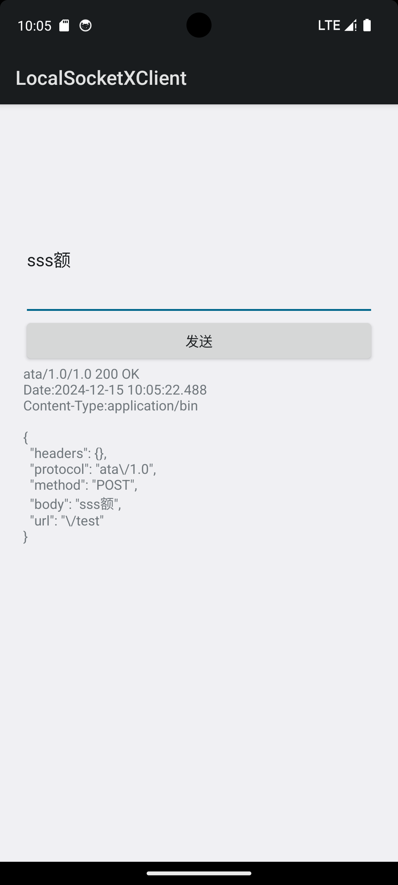
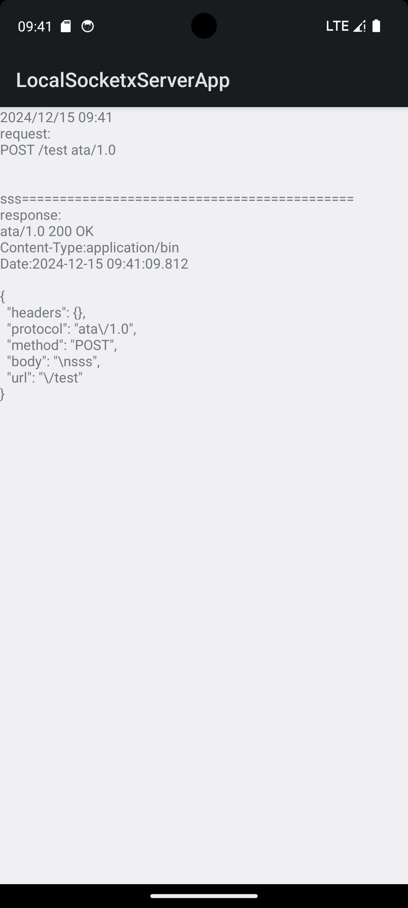

# LocalSocketX

This is an Android project, that use LocalSocket API and implements a like HTTP protocol.

Within the same application, using the LocalSocket API will not be restricted. However, if you need to use the LocalSocket API across different applications, you must ensure that the same `sharedUserId` is set. If this setting is not configured, you will encounter a `permission denied` exception.

